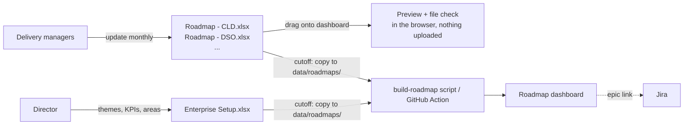

# Enterprise Roadmap (POC)

An enterprise roadmap that rolls up product-area roadmaps. Each **delivery manager keeps their product area's roadmap in an Excel workbook** built from a template. At the monthly or quarterly cutoff, the workbooks are combined into the enterprise roadmap, which is published as a static page (Azure Static Web Apps, or run locally). Each initiative links to its **Jira epic** for story-level detail.



**Drill-down path:** Enterprise (by theme or product area) → Product area roadmap → Initiative panel (milestones, dependencies, risk, Jira epic) → Jira.

## How it works for delivery managers

1. Each DM gets **`Roadmap - <CODE>.xlsx`** for their product area, kept in a shared Teams/SharePoint folder. Tabs: Instructions, Product Area (code in cell B1), Initiatives, Milestones, Reference. Dropdowns for theme, horizon, status and milestone type; date checks; duplicate-ID check; red/amber highlighting for bad dates, missing risk notes and stale reviews.
2. They update it monthly (at least quarterly), setting **Last reviewed** on each row they check.
3. **Preview:** on the dashboard, click **Preview a roadmap file** (or drag the workbook onto the page). Their area is shown in the context of the enterprise roadmap, with a list of anything to fix in the file. The file is read in the browser only.
4. They save the file in the shared folder by the cutoff.

## How it works for you (the Director)

- **`Enterprise Setup.xlsx`** holds settings (org name, fiscal-year start, Jira URL), strategic themes with KPI baseline/current/target, and product areas with their delivery managers.
- **New product area or theme?** Update Enterprise Setup, then regenerate blank workbooks so the dropdowns match:
  `python3 templates/make_templates.py "templates/Enterprise Setup.xlsx"` (needs `pip install openpyxl`). Existing DM workbooks keep working; only their dropdown lists are older.
- **At the cutoff:** copy Enterprise Setup and all product workbooks into `data/roadmaps/`, then either
  - **locally:** `node scripts/build-roadmap.mjs && npx serve site`, or
  - **hosted:** upload them to `data/roadmaps/` in GitHub (Add file → Upload files). The workflow builds and deploys.
- The build prints anything that needs fixing (unknown theme, missing product area code, milestones pointing to a missing initiative, duplicate IDs across areas).

## What's in the repo

| Path | What it is |
|---|---|
| `templates/` | `Enterprise Setup.xlsx`, `Roadmap - TEMPLATE.xlsx`, and the generator `make_templates.py` |
| `examples/roadmaps/` | A filled example set (5 product areas). Try `node scripts/build-roadmap.mjs examples/roadmaps` |
| `data/roadmaps/` | Where the real workbooks go at each cutoff |
| `site/` | The dashboard (`index.html`, `app.js`, `styles.css`), the preview (`preview.js`) and the shared workbook reader (`lib/xlsx-roadmap.js`) |
| `scripts/build-roadmap.mjs` | Combines the workbooks into `site/data/roadmap.json` |
| `scripts/csv-to-roadmap.mjs`, `scripts/sync-lists.mjs`, `lists/` | Alternative sources: MS Lists CSV exports, or MS Lists via Graph (needs an app registration) |
| `.github/workflows/roadmap.yml` | Builds from `data/roadmaps/` (or the alternatives) and deploys to Azure Static Web Apps |

Requires Node.js 20+ (`node -v`). No npm packages are needed.

## Automating later

When IT approves a Graph app registration (read-only, `Sites.Selected` on the one site), the build can read the workbooks straight from the shared Teams folder on a schedule. The DM process doesn't change; only the manual copy at the cutoff goes away.

## Alternative source: MS Lists CSV exports

If you can't get Graph permissions, the roadmap can be built from CSV exports of the lists instead:

1. In each of the four lists: **Export → Export to CSV**.
2. Put the four files in `data/lists/`. Any file names work as long as they contain *theme*, *area*, *initiative* and *milestone*.
3. Locally: `node scripts/csv-to-roadmap.mjs` then `npx serve site`.
4. Hosted: upload the CSVs to `data/lists/` in GitHub (Add file → Upload files). The workflow builds and deploys the page. Re-export and re-upload whenever you want to refresh it.

The trade-off: refreshing is manual, and the exports are stored in the (private) repo. Switch to the Graph sync once an admin approves the app registration; delete `data/lists/` and the workflow uses Graph automatically.

## Alternative source: MS Lists via Graph

The sections below describe the original MS Lists design. They still work if you later prefer Lists over workbooks.

### The data model (MS Lists)

One SharePoint site (e.g. `/sites/EnterpriseRoadmap`) with four lists. Product-area roadmaps are not separate lists. They are the **Initiatives** list filtered by product area, so the enterprise roll-up is never out of step with the product views.

| List | Key columns | Who maintains |
|---|---|---|
| **Strategic Themes** | Code, Title, KPI, KPI baseline / current / target, Sort order | You (quarterly) |
| **Product Areas** | Code, Title, Product owner, Delivery manager, Active | You |
| **Initiatives** | Initiative ID (`CLD-02`), Title, Product area (lookup), Strategic theme (lookup), Horizon, Status, Start / End date, Owner, Summary, Jira epic, Depends on (IDs), Risk note, Last reviewed | Delivery managers |
| **Milestones** | Initiative (lookup), Title, Date, Type (Release / Pilot / Review gate / Decision), Done | Delivery managers |

`Horizon` (Commit / Plan / Explore) is planning confidence. `Status` (On track / At risk / Off track / Not started / Done) is delivery health. They are separate on purpose.

## Setup (about an hour)

### 1. Create the lists
```powershell
Install-Module PnP.PowerShell -Scope CurrentUser       # PowerShell 7
Register-PnPEntraIDAppForInteractiveLogin -ApplicationName "PnP Roadmap Admin" -Tenant samtek.onmicrosoft.com
./lists/provision-lists.ps1 -SiteUrl https://samtek.sharepoint.com/sites/EnterpriseRoadmap -ClientId <app id from above> -WithSampleData
```
Drop `-WithSampleData` when you're ready for real data. Give each delivery manager **Edit** on the site (or on the Initiatives and Milestones lists).

### 2. App registration for the sync (read-only, one site)
1. Entra ID → App registrations → **New**: `Roadmap Sync`. Create a client secret.
2. API permissions → Microsoft Graph → **Application** → `Sites.Selected` → Grant admin consent.
3. Grant it read access to only the roadmap site:
   ```powershell
   Grant-PnPAzureADAppSitePermission -AppId <Roadmap Sync app id> -DisplayName "Roadmap Sync" -Site https://samtek.sharepoint.com/sites/EnterpriseRoadmap -Permissions Read
   ```

### 3. Azure Static Web App
1. Azure portal → Static Web Apps → **Create**. Plan: **Standard** (needed to restrict sign-in to your tenant). Deployment source: **Other** (the workflow in this repo deploys it).
2. Copy the **deployment token** (Overview → Manage deployment token).
3. Create a second app registration, `Roadmap Viewer`, for sign-in:
   - Redirect URI (Web): `https://<your-swa-host>/.auth/login/aad/callback`
   - Enable **ID tokens**. Create a client secret.
4. In the Static Web App → Environment variables: `AAD_CLIENT_ID` and `AAD_CLIENT_SECRET` (from `Roadmap Viewer`).
5. Replace `<YOUR_TENANT_ID>` in `site/staticwebapp.config.json`.
6. Optional: on the `Roadmap Viewer` enterprise app, set **Assignment required = Yes** and assign a security group to limit who can see the roadmap.

### 4. GitHub repo settings
**Secrets:** `TENANT_ID`, `SYNC_CLIENT_ID`, `SYNC_CLIENT_SECRET`, `AZURE_STATIC_WEB_APPS_API_TOKEN`
**Variables:** `SP_SITE` (`samtek.sharepoint.com:/sites/EnterpriseRoadmap`), `JIRA_BASE_URL`, `ORG_NAME`, `FISCAL_YEAR_START_MONTH` (1 = calendar year, 10 = US federal FY)

Then Actions → **Sync roadmap from MS Lists and deploy** → Run workflow.

### 5. Put it where people already work
- **Teams:** add a Website tab pointing at the SWA URL in your leadership channel and each product team's channel. Deep-link product teams straight to their roadmap: `https://<host>/#/product/CLD`.
- **SharePoint:** add a Quick Link from the roadmap site's home page.

## Working rhythm for delivery managers

- Keep **Status**, **Risk note**, and dates current in the Initiatives list. Update **Last reviewed** when you check an item, even if nothing changed.
- Add a **Review gate** milestone wherever leadership should check outcome impact. These feed the Outcomes view.
- Check **Project health** at the top of the dashboard before your roadmap review. Click a status, then a product area or theme, to drill down to the initiatives and their risk notes.

## Changes from the original mock-up

1. **One source, two views.** The mock-up hand-drew the product and enterprise views separately. Here the enterprise view is computed from product-area initiatives, so they can't drift apart.
2. **Real drill-down.** Enterprise → product area → initiative panel → Jira epic, with deep links (`#/product/CLD/CLD-02`) you can paste into Teams or email.
3. **Real calendar.** Fiscal quarters from real dates (configurable FY start) instead of relative Q1–Q6, a Today line, and a 12/18/24-month window.
4. **Confidence and health are both visible.** Bar fill shows horizon (solid Commit, light Plan, dashed Explore); a dot shows status. The mock-up's note that horizon isn't status is now built into the encoding.
5. **Dependencies are checked, not just noted.** Conflicts (a dependent starting before its dependency finishes) are flagged on the bar and in the panel. Hovering a bar highlights what it depends on and what it blocks.
6. **Outcomes have numbers.** Each theme carries a KPI baseline, current value and target; review gates come from milestones instead of being typed into the page.
7. **Project health drill-down.** Status mix → at-risk / off-track by product area or theme → initiatives with risk notes → initiative panel.

## Known POC limits and what to do next

- **Owners are text, not People columns.** Switching to Person columns needs the sync to resolve names through the User Information List.
- **Jira progress is mocked.** The sample data has a `jira` object per initiative (`total`, `done`, `inProgress`, `blocked`, `forecastEnd`) and the page renders it. The sync doesn't populate it yet; that's a Jira REST call per epic (`/rest/api/3/search/jql` with `parent = <epic>`).
- **Refresh is scheduled.** Changes in Lists show up at the next run (4x per weekday) or when someone clicks Run workflow. For near-real-time, a Power Automate flow on item change can call GitHub's `workflow_dispatch` API (needs the premium HTTP connector).
- **Dates assume a US time zone site.** See the note on `day()` in `scripts/sync-lists.mjs`.
- **Everyone who can sign in sees everything.** Fine for an internal roadmap. Per-area visibility would need a different hosting model.
